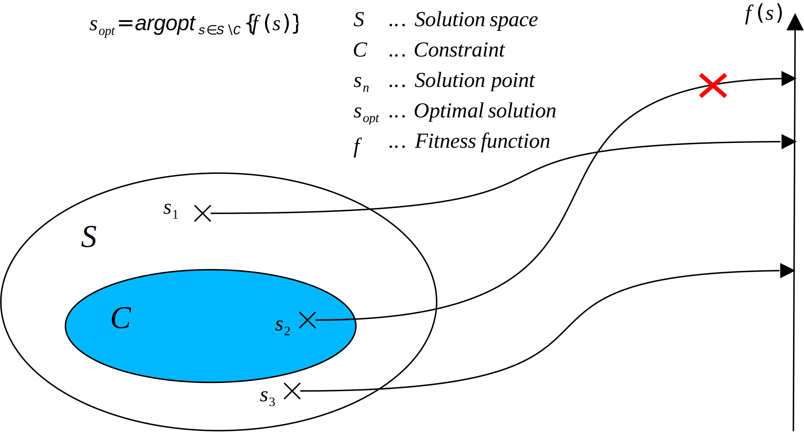

# Optimizing with Jenetics

Jenetics is a library which allows to solve optimization problems using metaheuristic methods.

> In computer science and mathematical optimization, a metaheuristic is a higher-level procedure or heuristic designed to find, generate, tune, or select a heuristic (partial search algorithm) that may provide a sufficiently good solution to an optimization problem or a machine learning problem, especially with incomplete or imperfect information or limited computation capacity.
> 
> [_Wikipedia_: Metaheuristic](https://en.wikipedia.org/wiki/Metaheuristic)

Trying to solve a non-trivial optimization problem, one might be overwhelmed by the problem itself **and** the _correct_ usage of the Jenetics library. This might be the case when one is not familiar with Metaheuristics in general, or the field of Evolutionary algorithms in particular. The following will give a simple _methodology_ when developing optimization algorithms with Jenetics.

Before describing one best practise when implementing an optimization algorithms with Jenetics, we should recap what an optimization problem actually is.

> In mathematics, engineering, computer science and economics, an optimization problem is the problem of finding the best solution from all feasible solutions.
> 
> [_Wikipedia_: Optimization problem](https://en.wikipedia.org/wiki/Optimization_problem)

A graphical representation of an optimization problem is shown in the diagram above.



 From a given solution space, _S_, we want to find the solution with the _optimal_ fitness value, which fulfills a given constraint, _C_. With this definition, we can start and suggest some implementation strategies using Jenetics.

## General methodology

Jenetics uses the `Genotpye` class as unified view onto the solution space of the problem. For trivial "Hello World"-problems, it is totally fine to describe the solution space in terms of this class. E.g. for the Bit-count _text book_ example, where the fitness function directly uses the `Genotype` as input parameter.

```java
static int count(final Genotype<BitGene> gt) {
    return gt.chromosome()
        .as(BitChromosome.class)
        .bitCount();
}
```

For non-trivial optimization problems, using the encoding classes  `Genotype`, directly is not the best way using the Jenetics library. 

It is recommended to first find a domain model, `S`, which best represents your solution space. Ideally, the domain model doesn't allow the modelling of invalid solutions. The fitness function calculates the fitness value with the model class `S`, instead of the `Genotype`, which usually simplifies the implementation. 

> **Hint:** Choose a _native_ solution model, `S`, which is able to represent only valid solution candidates, or as view as possible invalid solution candidates.

To connect the _native_ domain model and the fitness function with the Jenetics `Engine`, an appropriate `Codec` must be implemented. The `Codec` is the connector between the _native_ model and the `Engine`. With this approach, one can separate the problem of implementing the fitness function from the _mapping_ between `Genotype` and _native_ model `S`.

> **Hint:** The `Codec` should map every `Genotype` to only valid solution candidates in `S`, or as view as possible invalid solution candidates. Every `Genotype` should also be mapped to only one solution candidate in `S`.

**Implementation steps**
1) Find domain model, `S`, for the solution space.
2) Implement the fitness function in terms of `S`.
3) Find a `Codec` which maps a `Genotype` to `S`. 
4) Setup `Engine` with `Codec` and fitness function, _f(S)_.

The following code snippet shows how to use a `Codec` for the Ones-count problem, introduced above. It shows the steps 2 to 4 from the general solution template. Step 1, finding the domain model representing the solution space, is trivial in this example: `S := int`.

```java
// 2. Fitness function working on native solution space.
static int count(final int count) {
    return count;
}

// 3. Codec for Genotype <--> int mapping.
final Codec<Integer, BitGene> codec = Codec.of(
    Genotype.of(BitChromosome.of(100)),
    gt -> gt.chromosome()
        .as(BitChromosome.class)
        .bitCount()
);

// 4. Engine creation.
final static Engine<BitGene, Integer> engine = Engine
    .builder(this::count, codec)
    .build();
```

Although the given guideline seems quite simplistic, it allows to break down the implementation process into several step, which can be solved one after another. And this can help to reduce the overall complexity of the final implementation.

## Mixed permutation problems

Permutation problems are usually encoded by using the `PermutaionChromosme`, which guarantees that only permutations of a given gene set are possible. This works fine, if your problem is a purely permutational one. For _mixed_ problems, the `PermutationChromosome` can no longer be used, since all `Gene`s in a `Genotype` must be from the same time. The usual strategy for _numerical_ optimization problems is to use only `DoubleChromosome`s and cast the `double` values to `int`s in the codec, if integer values are required. E.g. imagine the following solution space model:

```java
record Solution(
    // Some scaling factor.
    double scale,
    // Some size value.
    int size,
    // Some element permutation.
    int[] permutations
) {}
```

Such a solution model can't directly be encoded with the available chromosomes, since each solution parameter has a different type. With a simple trick, it is nevertheless possible to use three `DoubleChromosome`s to encode the `Solution` class.

```java
final Codec<Solution, DoubleGene> codec = Codec.of(
    Genotype.of(
        DoubleChromosome.of(DoubleRange.of(0.0, 1.0)),
        DoubleChromosome.of(DoubleRange.of(0, 1000)),
        DoubleChromosome.of(DoubleRange.of(0.0, 1.0), 100)
    ),
    gt -> new Solution(
        gt.gene().doubleValue(),
        gt.gene().intValue(),
        ProxySorter.sort(
            gt.chromosome()
                .as(DoubleChromosome.class)
                .toArray()
        )
    )
);
```

The encoding of the `scale` and `size` is straight forward and doesn't need additional explanation. Using the `ProxySorter` allows to encode a permutation as `DoubleChromosome`. What it does is, that the `ProxySorter` doesn't sort the input `double[]` array directly. Instead, it returns a _permutation_ array, which contains the _sorted_ indexes of the input.

## Combining codecs

If the solution model itself consists of _nested_ models, it is possible to define `Codec`s for each of the _nested_ models and combine these sub `Codec` classes to the final `Codec`.

```java
record ParentSolution(
    int[] counters,
    Solution nested
) {}
```

It is now possible to implement a `Codec` for the `counters`

```java
final Codec<int[], DoubleGene> countersCodec = Codecs.ofVector(DoubleRange.of(0.0, 1000.0))
    .map(array -> {
        final var result = new int[array.length];
        for (int i = 0; i < array.length; i++) {
            result[i] = (int)array[i];
        }
        return result;
    });
```

and combine it with the already existing `Codec` for the _nested_ solution.

```java
final Codec<ParentSolution, DoubleGene> codec = Codec.of(
    countersCodec, nestedCodec,
    (counters, nested) -> new ParentSolution(counters, nested)
);
```

This way it is possible to split codecs into sub-codecs and combine it again.

***

With these simple Jenetics tricks, it is possible to split the overall problem in smaller parts and make it manageable. Especially the possibility to combine several `Codec`s into one _uber_ `Codec` is a might, but, unfortunately, overlooked feature of Jenetics. 