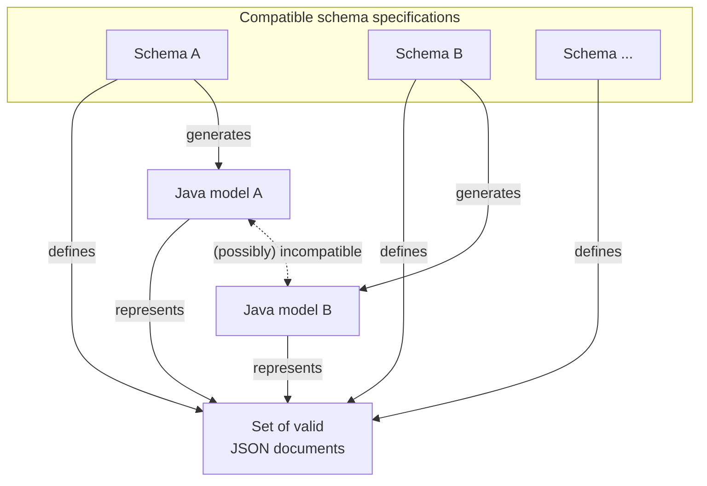

# `io.jenetics.incubator`

# (OpenAPI) Schema compatability

This section describes the definitions and assumptions which are used for the _extended_ compatibility concept. For the microservice environment in the TF, the API and schema compatibility must also include the generated (Java) code.

**Definitions**

1) _Schema specification_: A schema specification defines a set valid JSON documents.
2) _Compatible schema specifications_: Two schema specifications which defines the same set of JSON documents are called **compatible**.

**Corollary**

1) One schema specification defines exactly one set of valid JSON documents.
2) A set of valid JSON documents can be described by arbitrary many schema specifications.
3) Two _compatible_ schema specifications may lead to two _incompatible_ Java models.
4) Two _incompatible_ Java class models, generated from _compatible_ schema specifications, represents the same set of _compatible_ JSON documents.

**Relations**

