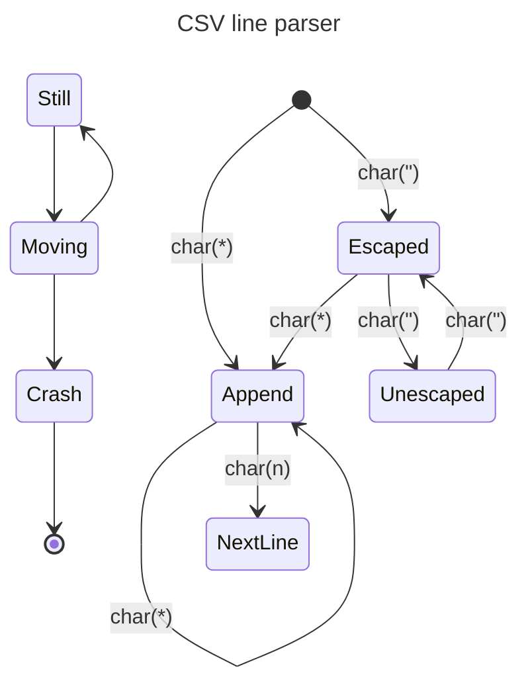

```mermaid
---
title: CSV line parser
---
stateDiagram-v2
	[*] --> Append: char(*)
	[*] --> Escaped: char(")
	
	Append --> Append: char(*)
	Append --> NextLine: char(n)
	
	Escaped --> Append: char(*)
	Escaped --> Unescaped: char(")
	Unescaped --> Escaped: char(")

    Still --> Moving
    Moving --> Still
    Moving --> Crash
    Crash --> [*]
```